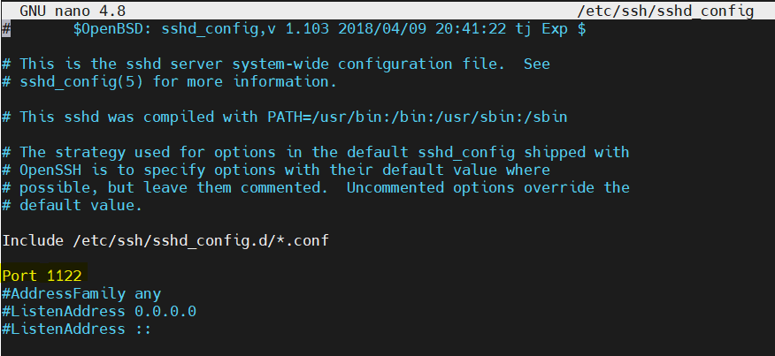
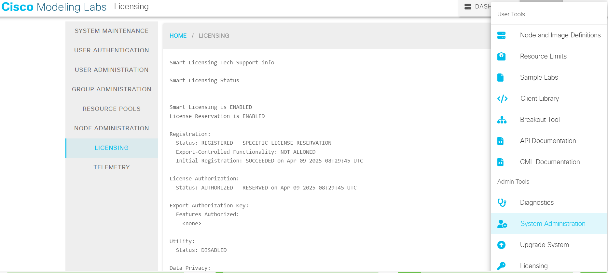
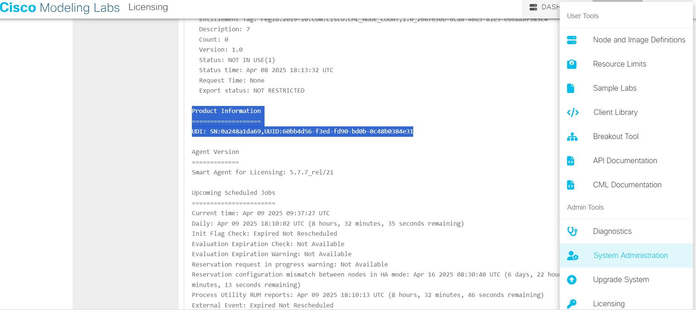
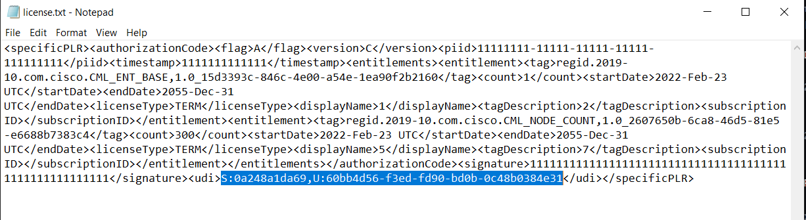

# study
***
***
### Repository created to take a note of settings used in system and Nework Administration practices
***
### Cisco CML Setup After Installation

#### Instruction
Right after CML VM installation SSH port to be changed into 1122 in CLI in order to setup license porblem.
>
>If SSH server is not installed
```
apt update
apt install openssh-server
systemctl enable ssh
```
>
>change SSH port
```
nano /etc/ssh/sshd_config
```


>
>restart SSH Server
```
systemctl restart ssh
systemctl status ssh
```

SSH to CML VM via your host machine and copy **libsmartunified.so** into **/tmp**

[MobaExtreme](https://mobaxterm.mobatek.net/download.html) is a handy tool to help.

Copy or Move **libsmartunified.so** file  to  **/var/local/virl2/.local/lib/smart/**  using console.
To get root access type:
```
sudo -E -s
mv /tmp/libsmartunified.so /var/local/virl2/.local/lib/smart/
```
>
>Reboot the CML VM.

Now login with Web UI into CML and go to **Tools > System Administration > Licensing** and search **UDI**.

>
>Copy the **SN: XXXXXXXXXXX and UUID: XXXXXXXX-XXXX-XXXX-XXXX-XXXXXXXXXXXX**






Download and open **license.txt** file with notepad and paste the

SN: and UUID to under **S: XXXXXXXXXXX,U:XXXXXXXX-XXXX-XXXX-XXXX-XXXXXXXXXXXX** and save the **license.txt** file.



>
>Go to **Tools> Licensing Product Configuration** and edit and select **Enterprise License - CML-ENT-BASE**

Now under **Tools> Licensing** click **Register** and click here under ` If your Smart Account is authorized for License Reservations ` and you wish to reserve licenses

   - and click ` YES, MY SMART ACCOUNT IS LICENSE RESERVATION ENABLED `

   - and click ` GENERATE RESERVATION REQUEST CODE `

   - and Click to ` SAVE TO FILE ` and ` Cancel ` the window.

>
>Now click the ` ENTER RESERVATION CODE ` and click the attach file icon and select the **license.txt** file

>
>Now click ` INSTALL AUTHORIZATION CODE` . That's it.


